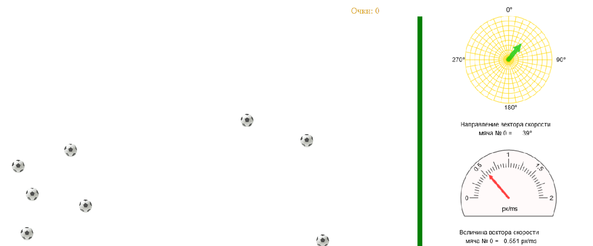

# jsBalls
Game application on js for demonstrating the use of animation with the ability to control objects by the user, displaying the parameters of the movement of objects on the dashboard. Motion modeling is based on the numerical solution of differential equations. The application supports mobile devices.

Игровое приложение на js для демонстрации использования анимации с возможностью управления объектами пользователем, отображением параметров движения объектов на приборной панели. Моделирование движения основано на численном решении дифференциальных уравнений. Приложение поддерживает мобильные устройства. 

## Описание

Анимация построена с использованием стандарта [Animation timing](https://www.w3.org/TR/animation-timing/) (`requestAnimationFrame`). Изображения `` движутся в блоке `
`. Изображение приборной панели реализовано на элементе `<canvas>`. На ней отображается направление и величина вектора скорости брошенного мячика.  
Вычисления координат мячиков в зависимости от времени делается путем численного интегрирования системы дифференциальных уравнений математической модели. В ней описано поведение объектов при полете - свободное падения (ускорение задается в форме настройки), качение и торможение под действием силы трения, отскок (уменьшение скорости при столкновении задается в форме настройки).
Захват и бросание мячика реализовано по технологии [Drag'n'Drop]( https://learn.javascript.ru/drag-and-drop-objects).
Форму параметров настройки можно вызвать по `F4` или из формы, которая вызывается по правой кнопке мыши (в мобильных устройствах по длительному касанию экрана).

[Запустить программу.]( http://sergechurkin.vacau.com/ball.html)
